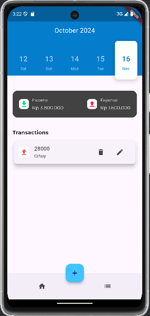
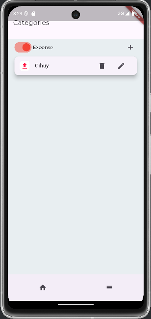
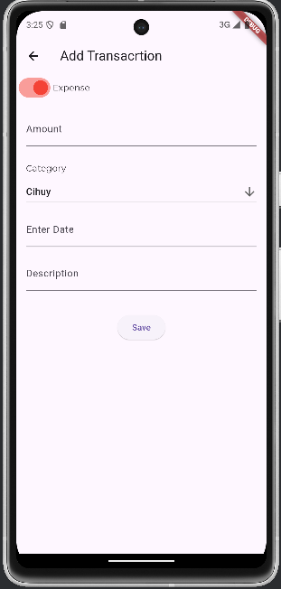

# Dooit

Dooit adalah aplikasi manajemen keuangan pribadi berbasis Flutter yang memungkinkan pengguna untuk melacak transaksi pemasukan dan pengeluaran dengan mudah. Aplikasi ini didesain agar intuitif dan membantu pengguna mencapai tujuan finansial mereka.

## Fitur

- **Manajemen Transaksi**: Tambahkan transaksi dengan kategori **Income** atau **Expense**.
- **Kategori Kustom**: Pengguna dapat membuat dan mengelola kategori sesuai kebutuhan.
- **Laporan Keuangan**: Lihat ringkasan transaksi harian
- **Antarmuka Modern**: Desain UI yang responsif dengan integrasi Google Fonts.

## Teknologi yang Digunakan

- **Flutter**: Untuk membangun antarmuka pengguna (UI).
- **SQLite**: Database lokal untuk menyimpan data transaksi secara offline.
- **Dart**: Bahasa pemrograman untuk mengembangkan aplikasi.
- **Intl Library**: Mengelola format tanggal dan waktu.

## Instalasi

1. **Clone repository**:
   ```bash
   git clone https://github.com/Lana2805/Dooit.git
   cd Dooit
2. **Install Dependencies**:
   ```bash
   flutter pub get
3. **Running App**:
   ```bash
   flutter run

## Preview




